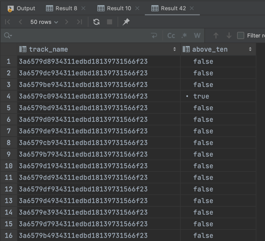

## Walk-through

#### Step 1: Download zip file

First the script downloads the zip file that has the GPX data included.

```python
def download_zip_file():
    """ Downloads and unpacks zip file"""

    with open(f"{download_dir}/data.zip", "wb+") as f:

        r = requests.get(ZIP_FILE_URL)
        r.raise_for_status()

        for line in r.iter_content(chunk_size=8192):
            f.write(line)

    zipfile.ZipFile(f"{download_dir}/data.zip").extractall(download_dir)
```

#### Step 2: Process geodata

It then loops through the files in that directory, extracting the geodata.
For this it goes through each `trackpoint` object.
To achieve consistency in the output, we use this geojson structure, to map all fields.

```python
def create_geojson(track_name, point_id, point_data):
    """ Creates GeoJSON object from point data"""

    return {
        "track_name": track_name,
        "id": point_id,
        "latitude": float(point_data["@lat"]),
        "longitude": float(point_data["@lon"]),
        "coordinates": wkb.dumps(
            geometry.Point(
                float(point_data["@lat"]),
                float(point_data["@lon"])
            ),
            hex=True
        ),
        "gpx_time": point_data["time"].replace("T", " "),
        "speed": float(point_data["extensions"]["gpxtpx:TrackPointExtension"]["gpxtpx:speed"]),
        "course": float(point_data["extensions"]["gpxtpx:TrackPointExtension"]["gpxtpx:course"])
    }
```

We dump the geodata in `HEX` format, as this can be processed by Redshift natively.
See the link here: https://docs.aws.amazon.com/redshift/latest/dg/copy-usage_notes-spatial-data.html.
All the other required fields are also unpacked.

We then add a location tag. This can later be extended by an API or database that has more 
lat-lon to location pairs.

```python

KNOWN_LOCATIONS = {
    "50.76;-1.29": "Cowes East",
    "50.76;-1.30": "Cowes",
    "50.83;-0.96": "Hayling Island (Havant)",
    "50.80;-0.94": "Hayling Island"
}

def find_location_tag(latitude, longitude):
    """ Finds location tag based on current shortened lat / lon """

    shortened_lat = str(latitude)[:5]
    shortened_lon = str(longitude)[:5]

    return KNOWN_LOCATIONS.get(f"{shortened_lat};{shortened_lon}", "")
```

We also check if the datapoints are valid. 
We do this based on whether or not the distance between trackpoints is too far (anomaly)
or if the speed or course is set to `0` or smaller. This could indicate that the boat is
on land or the data is simply incorrect.

```python
def check_if_coordinate_is_valid(
    current_point,
    prev_point,
    threshold=VALID_POINT_DISTANCE_IN_METERS
):
    # Check if speed is invalid of if the boat is on land (speed = 0)
    if current_point["speed"] <= 0:
        return False

    # Check if course is invalid
    elif current_point["course"] <= 0:
        return False

    # Check if distance is realistic (detect outliers)
    elif prev_point and calc_distance_between_coordinates(
        (current_point["latitude"], current_point["longitude"]),
        (prev_point["latitude"], prev_point["longitude"])
    ) > threshold:
        return False

    return True
```

We then output the data in CSV format to S3 along with a manifest file.
This manifest file can be used to `COPY` all data from the S3 bucket into the Redshift table.
See an example below.

```json
{
  "entries": [
    {"url": "s3://jetkwy-de-dev-test/test/3a6579b4934311edbd18139731566f23.csv", "mandatory": true},
    {"url": "s3://jetkwy-de-dev-test/test/3a6579bf934311edbd18139731566f23.csv", "mandatory": true},
    {"url": "s3://jetkwy-de-dev-test/test/3a6579c2934311edbd18139731566f23.csv", "mandatory": true},
    {"url": "s3://jetkwy-de-dev-test/test/3a6579ce934311edbd18139731566f23.csv", "mandatory": true},
    {"url": "s3://jetkwy-de-dev-test/test/3a6579c7934311edbd18139731566f23.csv", "mandatory": true}
  ]
}
```

The `COPY` statement is as followed:

```sql
DROP TABLE IF EXISTS test_schema.geodata_processing;
CREATE TABLE test_schema.geodata_processing
(
    track_name      VARCHAR(100),
    id              BIGINT,
    latitude        FLOAT,
    longitude       FLOAT,
    coordinates     geometry,
    gpx_time        TIMESTAMP,
    speed           FLOAT,
    course          FLOAT,
    location_tag    VARCHAR(100),
    is_valid        BOOL
)
;

COPY test_schema.geodata_processing
  FROM 's3://my-test-bucket/geo-processing/manifest.json'
  IAM_ROLE 'arn:aws:iam::000000000000:role/redshift-s3-reader-all'
  REGION 'eu-west-1'
  DELIMITER '|'
  IGNOREHEADER 1
  EMPTYASNULL
  BLANKSASNULL
  CSV
  MANIFEST
;
```

Data can afterwards be queried in Redshift and geometry data is loaded in native format.

```sql
SELECT DISTINCT
    track_name      AS track_name,
    MAX(speed) > 10 AS above_ten
FROM test_schema.geodata_processing
GROUP BY 1
LIMIT 100
;
```

